# ArthurTech / SkufAddon — Дерево Крафтов и Прогрессия (Steam → UHV)

Данный документ содержит полное интерактивное дерево крафта всех 10 эр ArthurTech, от первого Скуфитового Слитка до Деревенского Покоя (UHV).

## 📊 Граф прогрессии (Mermaid Flowchart)

```mermaid
flowchart TD
  %% --- CHAPTER 1: STEAM ---
  subgraph C1 ["1 · Грязный двор (Steam)"]
    C1_SkufitOre["skufit_vein<br/>(Руда Скуфита)"] --> C1_SkufitIngot["skufit_ingot<br/>[Скуфитовый Слиток]"]
    C1_Flesh["Органика / Отходы"] --> C1_NormieDust["normie_dust_dust<br/>[Нормис-пыль]"]
    C1_SkufitIngot --> C1_Steel["honest_steel_ingot<br/>(((1.5 · Честная Сталь)))"]
    C1_NormieDust --> C1_Steel
    C1_SkufitIngot --> C1_Sweat["sweat<br/>(Скуфий Пот)"]
  end

  %% --- CHAPTER 2: LV ---
  subgraph C2 ["2 · ЧПУ-станкчанин (LV)"]
    C1_Steel --> C2_Hull["lv_smoldering_pukan<br/>(((2.1 · Тлеющий Корпус LV)))"]
    C2_Hull --> C2_CNC["lv_cnc_machine<br/>[[2.2 · LV ЧПУ Станок]]"]
    C2_CNC --> C2_Cutter["cnc_cutter<br/>[2.3 · ЧПУ Резец]"]
    C2_Hull --> C2_Filter["lv_normis_filtration_machine<br/>[[2.4 · LV Фильтр]]"]
    C2_Filter --> C2_Distill["lv_pot_distillery<br/>[[2.5 · LV Дистиллятор]]"]
    C1_Sweat --> C2_Jizhnyak["jizhnyak<br/>[2.6 · Жижняк]"]
    C1_NormieDust --> C2_Jizhnyak
    C2_Jizhnyak --> C2_Distill
    C2_Distill --> C2_Matter["correct_matter_gem<br/>[2.7 · Правильная Материя]"]
    C2_Matter --> C2_Dodik1["dodik_circuit_1<br/>(((2.8 · Схема Додика I)))"]
    C2_Cutter --> C2_Dodik1
  end

  %% --- CHAPTER 3: MV ---
  subgraph C3 ["3 · Разрабская неоднозначность (MV)"]
    C2_Dodik1 --> C3_Dodik2["dodik_circuit_2<br/>(((3.1 · Схема Додика II)))"]
    C3_Dodik2 --> C3_Skufizator["skufizator<br/>[[3.2 · Скуфизатор]]"]
    C1_SkufitIngot --> C3_Skufizator
    C3_Skufizator --> C3_Pokhuit["pokhuit_ingot<br/>[3.3 · Похуит]"]
    C3_Dodik2 --> C3_Stab["mv_vibe_stabilizer<br/>[[3.4 · Стабилизатор Вайба]]"]
    C2_Jizhnyak --> C3_Isotope["ural_isotope_dust<br/>[3.5 · Уральский Изотоп]"]
    C3_Stab --> C3_Isotope
    C1_NormieDust --> C3_Myposhko["myposhko_script<br/>[3.6 · Скрипт Мыпошко]"]
    C3_Pokhuit --> C3_Myposhko
    C3_Myposhko --> C3_Vesh["pravilnaya_vesh<br/>(((3.7 · Правильная Вещь)))"]
    C3_Isotope --> C3_Vesh
  end

  %% --- CHAPTER 4: HV ---
  subgraph C4 ["4 · Разбор Геймплея (HV)"]
    C3_Vesh --> C4_Dodik3["dodik_circuit_3<br/>(((4.1 · Схема Додика III)))"]
    C4_Dodik3 --> C4_Cap["capacitor<br/>[4.2 · Конденсатор]"]
    C4_Cap --> C4_Monitor["block_broken_monitor<br/>[[4.3 · Разбитый Монитор]]"]
    C4_Dodik3 --> C4_Charred["charred_developer_circuit<br/>[4.4 · Обугленная Схема]"]
    C4_Charred --> C4_Demo["demo<br/>[4.5 · Рабочее ДЕМО]"]
    C4_Monitor --> C4_Razbor["razbor_geympleya<br/>[[4.6 · Разбор Геймплея]]"]
    C4_Demo --> C4_Razbor
    C4_Razbor --> C4_Tears["technical_tears_dust<br/>(((4.7 · Технические Слёзы)))"]
  end

  %% --- CHAPTER 5: SAUNA & CHELYABINSK ---
  subgraph C5 ["5 · Сауна и Челябинск (HV/EV)"]
    C4_Tears --> C5_EgorCore["egor_core<br/>(((5.1 · Ядро Егора)))"]
    C5_EgorCore --> C5_Sauna["sauna_egora<br/>[[5.2 · Сауна Егора]]"]
    C2_Jizhnyak --> C5_Dense["dense_jizhnyak<br/>[5.3 · Плотный Жижняк]"]
    C5_Sauna --> C5_Dense
    C5_Dense --> C5_Shale["chelyabinsk_shale_dust<br/>[5.4 · Челябинский Сланец]"]
    C5_Sauna --> C5_Coolant["coolant_of_denial<br/>(((5.5 · Запрещённый Хладагент)))"]
    C5_Shale --> C5_Coolant
  end

  %% --- CHAPTER 6: ENDGAME ---
  subgraph C6 ["6 · Абсолютный Похуизм (эндгейм)"]
    C5_Coolant --> C6_Mainframe["arturian_mainframe<br/>(((6.1 · Главный Фрейм Артура)))"]
    C6_Mainframe --> C6_Pohuit["absolute_pohuit<br/>[6.2 · Абсолютный Похуизм]"]
    C6_Mainframe --> C6_Micro["correct_matter_microcapsule<br/>[6.3 · Микрокапсула Материи]"]
    C6_Pohuit --> C6_Anti["antizoomer_core<br/>[[6.4 · Антизумерное Ядро]]"]
    C6_Micro --> C6_Schem["correct_developer_schematic<br/>[6.5 · Схема Разработчика]"]
    C6_Anti --> C6_Singularity["normis_singularity<br/>(((6.6 · Сингулярность Нормиса)))"]
    C6_Schem --> C6_Singularity
  end

  %% --- CHAPTER 7: LuV ---
  subgraph C7 ["7 · Распадение Смысла (LuV)"]
    C6_Singularity --> C7_Reinforced["casing_pohuit_reinforced<br/>(((7.1 · Усиленный Похуитовый Корпус)))"]
    C7_Reinforced --> C7_Neutron["memetic_neutron_dust<br/>[[7.2 · Меметический Нейтрон]]"]
    C7_Reinforced --> C7_Defective["defective_meaning_dust<br/>[[7.3 · Дефектный Смысл]]"]
    C7_Neutron --> C7_Stabilizer["absolute_pohuit<br/>(((7.4 · Стабилизатор Смысла)))"]
    C7_Defective --> C7_Stabilizer
  end

  %% --- CHAPTER 8: ZPM ---
  subgraph C8 ["8 · Сингулярный Порядок (ZPM)"]
    C7_Stabilizer --> C8_Vtykatel["vibe_singularity<br/>(((8.1 · Сингулярный Втыкатель)))"]
    C8_Vtykatel --> C8_SingularVibe["vibe_singularity<br/>[[8.2 · Сингулярность Вайба]]"]
    C8_SingularVibe --> C8_OrderCore["factory_order_core<br/>(((8.3 · Ядро Заводского Порядка)))"]
  end

  %% --- CHAPTER 9: UV ---
  subgraph C9 ["9 · Обращение Энтропии (UV)"]
    C8_OrderCore --> C9_Concrete["casing_proval_concrete<br/>(((9.1 · Провальный Бетон)))"]
    C9_Concrete --> C9_FactoryFrame["casing_proval_concrete<br/>(((9.2 · Каркас Финальной Фабрики)))"]
  end

  %% --- CHAPTER 10: UHV ---
  subgraph C10 ["10 · Деревенский Покой (UHV)"]
    C9_FactoryFrame --> C10_Gate["arturian_mainframe<br/>(((10.1 · Врата Деревенского Покоя)))"]
    C10_Gate --> C10_Final["normis_singularity<br/>(((10.2 · Деревенский Покой - ФИНАЛ)))"]
  end
```

## 📋 Таблица сквозных рецептов по эрам

| Эра | Название предмета / блока | Тип рецепта / Станок | Входные ингредиенты | Продукт / Результат |
|---|---|---|---|---|
| **1. Steam** | `honest_steel_ingot` | Alloy Smelter | `skufit_ingot` + `normie_dust_dust` | `honest_steel_ingot` x4 |
| **2. LV** | `lv_smoldering_pukan` | Assembler (LV) | `honest_steel_plate` x8 + Cable | `lv_smoldering_pukan` |
| **2. LV** | `jizhnyak` | Mixer (LV) | `sweat` + `normie_dust_dust` + `puff_smoke` | `jizhnyak` (Fluid 1000 mB) |
| **2. LV** | `correct_matter_gem` | Autoclave (LV) | `jizhnyak` + Distillation | `correct_matter_gem` x2 |
| **2. LV** | `dodik_circuit_1` | Chemical Reactor (LV) | `correct_matter_gem` + `cnc_cutter` | `dodik_circuit_1` |
| **3. MV** | `dodik_circuit_2` | Chemical Reactor (MV) | `dodik_circuit_1` x2 + `pokhuit_plate` | `dodik_circuit_2` |
| **3. MV** | `skufizator` | Multiblock Assembler | `myposhko_script` + `pravilnaya_vesh` | `skufizator` |
| **3. MV** | `pokhuit_ingot` | Skufizator | `skufit_ingot` + `sweat` | `pokhuit_ingot` x4 |
| **3. MV** | `pravilnaya_vesh` | Assembler (MV) | `correct_matter_gem` + `dodik_circuit_2` | `pravilnaya_vesh` |
| **4. HV** | `dodik_circuit_3` | Chemical Reactor (HV) | `dodik_circuit_2` x2 + `crystallized_dodik_sweat` | `dodik_circuit_3` |
| **4. HV** | `block_broken_monitor` | Furnace / Smelter | `burnt_capacitor` + Glass | `block_broken_monitor` |
| **4. HV** | `razbor_geympleya` | Multiblock Assembler | `demo` + `myposhko_script` + `block_broken_monitor` | `razbor_geympleya` |
| **4. HV** | `technical_tears_dust` | Razbor Geympleya | `normis_singularity` | `technical_tears_dust` |
| **5. EV** | `egor_core` | Assembler (EV) | `correct_matter_gem` x2 + `honest_steel_plate` x4 | `egor_core` |
| **5. EV** | `sauna_egora` | Multiblock Assembler | `egor_core` + `pravilnaya_vesh` x2 + `pokhuit_frame` | `sauna_egora` |
| **5. EV** | `coolant_of_denial` | Chemical Plant | `technical_tears_dust` + `pokhuit_ingot` + Water | `coolant_of_denial` (Fluid 1000 mB) |
| **6. IV** | `arturian_mainframe` | Assembler (IV) | `honest_steel_plate` x8 + `correct_matter_gem` x4 | `arturian_mainframe` |
| **6. IV** | `normis_singularity` | Compressor (IV) | `normie_dust_dust` x16 + `slag_ignore_dust` x4 | `normis_singularity` |
| **7. LuV** | `casing_pohuit_reinforced` | Assembler (LuV) | `pokhuit_plate` x6 + `dodik_circuit_3` | `casing_pohuit_reinforced` |
| **7. LuV** | `memetic_neutron_dust` | Memetic Collider | Collision of `arturian_mainframe` + `stabilized_vibe` | `memetic_neutron_dust` |
| **7. LuV** | `defective_meaning_dust` | Memetic Collider | Byproduct decay ➔ `normie_dust_dust` + `slag_ignore_dust` | `defective_meaning_dust` |
| **8. ZPM** | `vibe_singularity` | Autoclave / Vtykatel | `stabilized_vibe` 16B + `sweat` 4B + `correct_matter` x2 | `vibe_singularity` |
| **8. ZPM** | `factory_order_core` | Assembler (ZPM) | `vibe_singularity` + `correct_matter_gem` + `dodik_circuit_3` | `factory_order_core` |
| **9. UV** | `casing_proval_concrete` | Mixer (UV) | `chelyabinsk_shale_dust` x4 + `honest_steel_dust` + Concrete | `casing_proval_concrete` |
| **10. UHV** | `uhv_final` | Final Gate (UHV) | `arturian_mainframe` + `normis_singularity` | `derevenskiy_pokoy` (Victory) |
