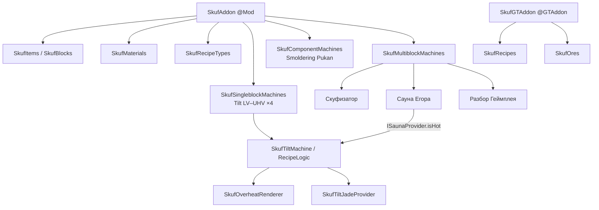
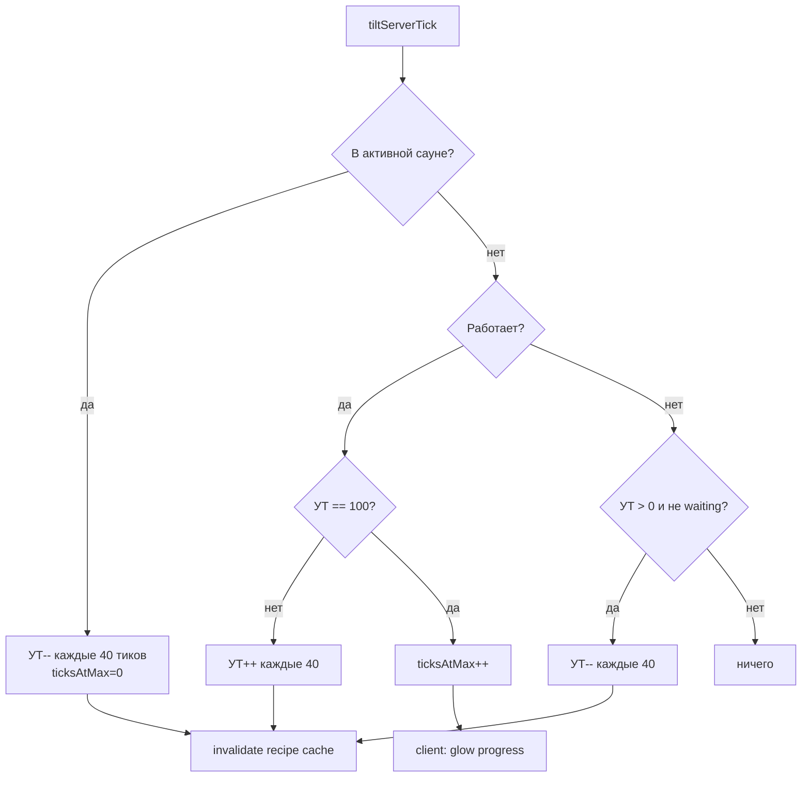

# Skuf Addon — полное описание логики проекта

Документ для человека, который **не может открыть GitHub**, но должен понять проект так, будто просмотрел весь репозиторий: структура, классы, механики, рецепты, мультиблоки, клиентский рендер.

| | |
|---|---|
| **Mod ID** | `skufaddon` |
| **Название** | Skuf Addon |
| **Версия** | `0.1.0` |
| **Автор** | arturgpt |
| **Лицензия** | LGPLv3.0 |
| **Minecraft** | 1.20.1 |
| **Loader** | Forge 47.4.0 (`javafml`) |
| **Зависимость** | GregTech CEu Modern (`gtceu`) **7.5.1** |
| **Java** | 17 |
| **Пакет** | `com.arturgpt.skufaddon` |
| **Исходников** | 26 Java-файлов |

---

## Оглавление

1. [Что это за мод](#1-что-это-за-мод)
2. [Стек и сборка](#2-стек-и-сборка)
3. [Дерево репозитория](#3-дерево-репозитория)
4. [Архитектура и точки входа](#4-архитектура-и-точки-входа)
5. [Карта пакетов](#5-карта-пакетов)
6. [Механика УТ (Tilt)](#6-механика-ут-tilt)
7. [Сауна Егора (провайдер тепла)](#7-сауна-егора-провайдер-тепла)
8. [Синглблоки и компоненты](#8-синглблоки-и-компоненты)
9. [Мультиблоки](#9-мультиблоки)
10. [Материалы](#10-материалы)
11. [Предметы и блоки](#11-предметы-и-блоки)
12. [Типы рецептов](#12-типы-рецептов)
13. [Цепочки прогрессии (все рецепты)](#13-цепочки-прогрессии-все-рецепты)
14. [Руды и мирген](#14-руды-и-мирген)
15. [Клиент: перегрев и glow](#15-клиент-перегрев-и-glow)
16. [Интеграция Jade](#16-интеграция-jade)
17. [Ресурсы, локализация, скрипты](#17-ресурсы-локализация-скрипты)
18. [Полный справочник классов](#18-полный-справочник-классов)
19. [Порядок инициализации](#19-порядок-инициализации)
20. [Диаграммы](#20-диаграммы)

---

## 1. Что это за мод

**Skuf Addon** — аддон к **GregTech CEu Modern** на Forge 1.20.1. Это не отдельная тех-линейка с нуля, а слой поверх GT:

- свои **материалы** (скуфит, похуит, пот, жижняк и т.д.);
- свои **машины** с уникальной механикой **УТ (уровень угара / tilt)**;
- **мультиблоки**: Скуфизатор, Сауна Егора, Разбор Геймплея;
- **корпуса** «Тлеющий Пукан» (аналог hull GT);
- прогрессия через кастомные рецепты в vanilla GT-машинах и своих рецепт-тайпах;
- клиентский эффект **перегрева** на пике УТ;
- плагин **Jade** для отображения УТ.

Тон контента — мемный/сленговый (додик, нормис, похуит, «Ваще похуй»), но код — обычный GT-аддон: Registrate, `IGTAddon`, `WorkableElectricMultiblockMachine`, datagen рецептов.

---

## 2. Стек и сборка

### Версии (`gradle.properties`)

| Свойство | Значение |
|---|---|
| `minecraft_version` | 1.20.1 |
| `forge_version` | 47.4.0 |
| `mapping_channel` | parchment |
| `mapping_version` | 2023.09.03 |
| `gtceu_version` | 7.5.1 |
| `ldlib_version` | 1.0.40.b |
| `registrate_version` | MC1.20-1.3.11 |
| `mod_version` | 0.1.0 |
| `maven_group` | `com.arturgpt.skufaddon` |

### Сборка

- Gradle **8.10**, плагин **NeoForged LegacyForge** (`net.neoforged.moddev.legacyforge`) — это всё ещё **Forge 1.20.1**, не NeoForge 1.21+.
- Spotless для форматирования (`gradle/scripts/spotless.gradle`).
- CI: `.github/workflows/gradle.yml` — JDK 17, `./gradlew build` на `main`.
- Datagen-ран выводит в `src/generated/resources/` (сейчас пусто в git; рецепты генерируются через GT addon SPI).

### Метаданные (`META-INF/mods.toml`)

- Обязательные зависимости: `forge`, `minecraft`, `gtceu` (ordering `AFTER`).
- Описание в mods.toml пока placeholder (Lorem Ipsum).

### Mixins

Файл `skufaddon.mixins.json` есть, но **активных миксинов нет** — только заглушка `DummyMixin`.

---

## 3. Дерево репозитория

```
skuf-addon/
├── .github/workflows/gradle.yml          # CI build
├── .tmp-gt/                              # Справки по GT API (НЕ компилируются)
├── gradle/                               # wrapper + spotless
├── scripts/                              # Python-генераторы текстур/моделей
├── spotless/                             # eclipse format + import order
├── src/main/
│   ├── java/com/arturgpt/skufaddon/      # весь игровой код (26 файлов)
│   └── resources/
│       ├── META-INF/mods.toml
│       ├── pack.mcmeta
│       ├── skufaddon.mixins.json
│       └── assets/skufaddon/
│           ├── lang/en_us.json, ru_ru.json
│           ├── blockstates/
│           ├── models/block|item/
│           └── textures/...
├── build.gradle
├── settings.gradle
├── gradle.properties
├── README.md                             # шаблон GT addon (не про Skuf)
├── LICENSE.MD                            # LGPLv3
└── PROJECT_LOGIC.md                      # этот документ
```

**Нет:** Kotlin, Fabric, datapack `data/skufaddon/` (луттейблы/теги JSON), активных миксинов.

---

## 4. Архитектура и точки входа

Мод стартует **двумя** точками входа GT/Forge:

### 4.1. `SkufAddon` — `@Mod("skufaddon")`

Главный Forge-мод. Создаёт `GTRegistrate`, вешает слушатели шины:

| Событие | Действие |
|---|---|
| `FMLCommonSetupEvent` | лог «common setup complete» |
| `FMLClientSetupEvent` | `SkufOverheatRenderer.init()` |
| `MaterialRegistryEvent` | `GTCEuAPI.materialManager.createRegistry(MOD_ID)` |
| `MaterialEvent` | `SkufMaterials.init()` |
| `PostMaterialEvent` | пусто |
| Register `GTRecipeType` | `SkufRecipeTypes.init()` |
| Register `MachineDefinition` | singleblock + component + multiblock |
| Register `SoundEntry` | пусто |

В конструкторе сразу:

```text
SkufItems.init()
SkufBlocks.init()
REGISTRATE.registerRegistrate()
```

Хелпер: `SkufAddon.id("path")` → `skufaddon:path`.

### 4.2. `SkufGTAddon` — `@GTAddon` / `IGTAddon`

Второй вход — SPI GregTech-аддона:

| Метод | Действие |
|---|---|
| `getRegistrate()` | возвращает `SkufAddon.REGISTRATE` |
| `addonModId()` | `"skufaddon"` |
| `addRecipes(provider)` | `SkufRecipes.init(provider)` — **весь datagen рецептов** |
| `registerOreVeins()` | `SkufOres.init()` |
| остальное | пустые заглушки (`initializeAddon`, `registerTagPrefixes`, `registerElements`) |

### 4.3. Jade

`SkufJadePlugin` с `@WailaPlugin` — автодискавери Jade, без явной регистрации в `SkufAddon`.

---

## 5. Карта пакетов

```
com.arturgpt.skufaddon
├── SkufAddon.java                 # @Mod
├── SkufGTAddon.java               # @GTAddon
│
├── api.machine
│   ├── ISaunaProvider             # «горячая» сауна
│   └── ISaunaReceiver             # машина, которую сауна остужает
│
├── client.render
│   ├── SkufOverheatRenderer       # красное свечение поверх модели
│   └── SkufOverheatRenderType     # кастомный RenderType
│
├── common.data                    # регистрация контента + рецепты
│   ├── SkufItems
│   ├── SkufBlocks
│   ├── SkufMaterials
│   ├── SkufOres
│   ├── SkufRecipeTypes
│   ├── SkufRecipes
│   ├── SkufSingleblockMachines
│   ├── SkufComponentMachines
│   └── SkufMultiblockMachines
│
├── common.machine.singleblock.tilt
│   ├── SkufTiltMachine            # SimpleTieredMachine + ISaunaReceiver
│   ├── SkufTiltRecipeLogic        # рост/спад УТ, scaling EU
│   └── SkufTiltUtils              # константы, формулы, режимы
│
├── common.machine.multiblock
│   ├── sauna/
│   │   ├── SaunaEgoraMachine
│   │   ├── SaunaEgoraLogic
│   │   └── SaunaEgoraPatterns
│   ├── skufizator/
│   │   └── SkufizatorPatterns
│   └── gameplay/
│       └── RazborGeympleyaPatterns
│
├── integration.jade
│   ├── SkufJadePlugin
│   └── SkufTiltJadeProvider
│
└── mixin
    └── DummyMixin                 # пустая заглушка
```

---

## 6. Механика УТ (Tilt)

Это **главная уникальная механика** аддона. Все четыре линейки синглблоков (Normis Filtration, CNC, Pot Distillery, Vibe Stabilizer) — это `SkufTiltMachine`.

### 6.1. Идея

Пока машина **работает**, у неё растёт **уровень УТ** (`tiltLevel`, 0…100). Чем выше УТ, тем **больше EU/t** у текущего рецепта (до ×4 на пике). Если долго стоять на 100 — появляется режим «Ваще похуй», визуальный перегрев (glow + дым + искры).

**Сауна Егора** внутри полости может **снижать** УТ даже во время работы.

### 6.2. Константы (`SkufTiltUtils`)

| Константа | Значение | Смысл |
|---|---|---|
| `TILT_GROW_INTERVAL` | 40 тиков (2 с) | Интервал +1/−1 УТ |
| `MAX_TILT_LEVEL` | 100 | Максимум |
| `HIDDEN_MODE_DELAY_TICKS` | 20 (1 с) | Через столько на пике UI пишет «УТ: ???» |
| `OVERHEAT_RAMP_TICKS` | 600 (~30 с) | Время до полного glow на пике |

### 6.3. Формула множителя EU

```text
multiplier = 1.0 + (tiltLevel / 100) * 3.0
```

| УТ | Множитель EU/t |
|---|---|
| 0 | ×1.00 |
| 30 | ×1.90 |
| 50 | ×2.50 |
| 100 | ×4.00 |

`applyTiltToRecipe` копирует рецепт и подбирает пару `(voltage, amperage)`, чтобы `voltage * amperage` было близко к `baseEU * multiplier` (плавное масштабирование через ампераж, не скачками вольтажа).

### 6.4. Режимы (локализация RU)

| Диапазон УТ | Режим | Стиль |
|---|---|---|
| 0–30 | **Угар** | зелёный |
| 31–60 | **Пот** | жёлтый |
| 61–99 | **Не потеем** | золотой |
| 100 | **Ваще похуй** | красный |
| 100 + ≥1 с | **Ваще похуй (УТ: ???)** | тёмно-красный bold |

### 6.5. Логика тиков (`SkufTiltRecipeLogic`)

Поля (персистятся и синкаются на клиент):

- `tiltLevel` (`@Persisted @DescSynced`)
- `ticksAtMaxTilt` (`@Persisted @DescSynced`)

Каждые `TILT_GROW_INTERVAL` тиков на сервере:

1. **В активной сауне** (`ISaunaReceiver` → provider ≠ null && `isHot()`):
   - УТ уменьшается, `ticksAtMaxTilt = 0`
2. **Иначе, если работает** (`isWorking && isWorkingEnabled`):
   - УТ < 100 → `tiltLevel++`
   - УТ == 100 → `ticksAtMaxTilt++`
3. **Иначе, если простаивает** (не working и не waiting, УТ > 0):
   - `tiltLevel--`, сброс `ticksAtMaxTilt`

Подписка на серверный тик (`tiltSubscription`) включается только когда УТ реально нужно менять (экономия).

При смене УТ инвалидируется кэш масштабированного рецепта.

EU-scaling применяется в:

- `handleTickRecipe` — реальное потребление;
- `getLastRecipe` — UI / tooltip / Jade показывают уже масштабированный рецепт.

### 6.6. Машина (`SkufTiltMachine`)

Наследует `SimpleTieredMachine`, реализует `ISaunaReceiver`:

- хранит ссылку на `ISaunaProvider`;
- `createRecipeLogic` → `SkufTiltRecipeLogic`;
- на клиенте каждый тик считает `clientGlowIntensity` из `getOverheatProgress(tilt, ticksAtMax)` и управляет `SkufOverheatRenderer` + партиклами (дым, large smoke, flame).

Glow:

- появляется **только при УТ = 100**, прогресс = `ticksAtMaxTilt / 600`;
- fade-in мгновенный к target, fade-out медленный (0.04 за тик).

### 6.7. API сауны

```java
public interface ISaunaProvider {
    boolean isHot();  // жар ≥ 95%
}

public interface ISaunaReceiver {
    ISaunaProvider getSauna();
    void setSauna(ISaunaProvider provider); // null = отвязать
}
```

Аналогия с cleanroom GT: провайдер окружения + ресиверы внутри полости, но вместо «чистоты» — «жар», который **остужает** УТ.

---

## 7. Сауна Егора (провайдер тепла)

### 7.1. Роль

Мультиблок **Сауна Егора** (`SaunaEgoraMachine`):

1. Нагревается (накапливает `heatAmount` 0…100), пока есть энергия EV+ и вода.
2. При `heatAmount ≥ 95` считается **горячей** (`isHot()`).
3. Горячая сауна остужает все `ISaunaReceiver` (tilt-машины), найденные в полости при формации структуры.
4. Пока горячая — пассивно производит **Тёплый Вайбовый Пар** (`warmVibeSteam`) в fluid export hatch.

Рецепт-тайп `sauna_egora` в JEI/EMI — **информационный**; реальная логика в `SaunaEgoraLogic`, не через обычный GT recipe match.

### 7.2. `SaunaEgoraLogic` (зеркало CleanroomLogic)

| Константа | Значение |
|---|---|
| `BASE_HEAT_AMOUNT` | 2 |
| `HEAT_AMOUNT_THRESHOLD` | 95 |
| `FLUID_PRODUCTION_INTERVAL` | 20 тиков |

Каждый серверный тик:

1. Если тир < EV → waiting «энерговвод EV+».
2. Если maintenance проблем ≥ 6 → остывание, IDLE.
3. Иначе: drain воды → drain энергии → WORKING.
4. Если hot → попытка выдать пар раз в 20 тиков.
5. По завершении цикла (`duration` = 400) → `adjustHeat(false)` (нагрев).
6. При нехватке ресурсов → `adjustHeat(true)` (остывание) по таймеру.

**Энергия:**

- пока не hot: `VA[tier]` за тик;
- когда hot: `max(8, 3 * V[tier] / 16)` (дешевле держать жар).

**Вода:** `max(1, steamPerCycle / 20)` mB/тик.

**Пар за цикл (20 тиков):**

```text
steam = 80 + (tier - EV) * 40 + (число tilt-машин внутри) * 60
```

База на EV без машин внутри: **80 mB/с** воды и **80 mB/с** пара (как в tooltip JEI).

Дельта жара за цикл:

```text
amount = BASE_HEAT + 3 * (tierDiff + 1) - maintenanceProblems
```

(при decline — со знаком минус).

### 7.3. Привязка ресиверов

При `onStructureFormed`:

1. `initializeAbilities()` — собирает energy/fluid handlers с частей (игнор diode/hull).
2. `bindReceivers()` — из match context `"saunaReceiver"` берёт set машин и вызывает `setSauna(this)`.

При `onStructureInvalid` — unbind + `resetHeatAmount()`.

В паттерне полости (`innerPredicate`) любой блок с `ISaunaReceiver` добавляется в set; другой `ISaunaProvider` внутри полости **запрещён**.

Сауна **всегда** `isWorkingEnabled() == true` (пауза не отключается).

---

## 8. Синглблоки и компоненты

### 8.1. Четыре линейки tilt-машин (`SkufSingleblockMachines`)

Для каждой линейки регистрируются тиры **LV…UHV** (`GTValues.tiersBetween`):

| Массив | ID базы | Рецепт-тайп | RU имя |
|---|---|---|---|
| `NORMIS_FILTRATION_MACHINE` | `*_normis_filtration_machine` | `normis_filtration` | Нормис Фильтратор |
| `CNC_MACHINE` | `*_cnc_machine` | `cnc_machine` | ЧПУ-станок |
| `POT_DISTILLERY` | `*_pot_distillery` | `pot_distillery` | Пот-Дистиллятор |
| `VIBE_STABILIZER` | `*_vibe_stabilizer` | `vibe_stabilizer` | Стабилизатор Вайба |

Фабрика: `holder -> new SkufTiltMachine(holder, tier)`, hull-модель `block/machines/<baseName>`.

### 8.2. Тлеющий Пукан (`SkufComponentMachines`)

`SMOLDERING_PUKAN[LV…UHV]` — тиерные hull-машины (`HullMachine`) с:

- `PartAbility.PASSTHROUGH_HATCH`
- overlay model `smoldering_pukan`
- используются как **корпус** при крафте tilt-машин и как passthrough в Сауне

Крафт hull (shaped):

| Тир | Пластины + кабель |
|---|---|
| LV | Честная Сталь |
| MV | Похуит |
| HV | Кристаллизованный Пот Додика |

---

## 9. Мультиблоки

Регистрация в `SkufMultiblockMachines`.

### 9.1. Скуфизатор (`skufizator`)

| | |
|---|---|
| Класс контроллера | стандартный `WorkableElectricMultiblockMachine` |
| Рецепт-тайп | `skufization` |
| Модификаторы | `OC_NON_PERFECT_SUBTICK`, `BATCH_MODE` |
| Корпус | каркасы скуфита |
| Центр | колонна **Правильной Материи** (блок) |
| Форма | «самовар» **5×5×6** |
| Hatches (пример) | MV: energy, item in/out, fluid in, maintenance |
| Мин. каркасов | 20 |

Слои (схематично):

```text
Y0 floor:   #CCC# / CCCCC ×3 / #CCC#
Y1 bowl:    стенки C, воздух #, центр P, контроллер S на передней грани
Y2 rim:     #CCC# с P в центре
Y3–Y5:      только ##P## (труба)
```

Крафт контроллера: Скрипт Мыпошко + 2× Правильная Вещь + 4× frame скуфита + жидкий Жижняк Потерь.

Пример рецепта скуфизации: 1 ingot скуфита + 250 mB пота → 2 ingot похуита.

### 9.2. Сауна Егора (`sauna_egora`)

| | |
|---|---|
| Класс | `SaunaEgoraMachine` |
| Рецепт-тайп | `sauna_egora` (info) |
| Корпус | Plastcrete (GT) |
| Каркас акцента | frame похуита |
| Размер | **18 × 11 × 3** |
| Energy | EV…MAX, 1–3 hatch |
| Fluid | 1 import, 1–2 export |
| Passthrough | 1–16 (для tilt-машин / кабелей) |
| Полость | air / машины-ресиверы |

Контроллер крафтится из Ядра Егора + 2× Нормисной Сингулярности + frames похуита + стабилизированный вайб (EV).

### 9.3. Разбор Геймплея (`razbor_geympleya`)

| | |
|---|---|
| Класс | `WorkableElectricMultiblockMachine` |
| Рецепт-тайп | `razbor_geympleya` |
| Модификаторы | OC + BATCH |
| Корпус | frame похуита |
| Экран | блок **Разбитый Монитор** (сетка 12×5 внутри) |
| Размер | **14 wide × 3 deep × 7 tall** |
| Energy | HV…MAX |

Крафт: Демка + Скрипт Мыпошко + 2× Обугленная Плата + 4× Кабельные Обломки + дым.

Основной процесс: **Демка → 1000 mB Технических Слёз**.

---

## 10. Материалы

Все в `SkufMaterials.init()`, namespace `skufaddon:<id>`.

### 10.1. Металлы / руды / кабели

| ID | RU | Формы | Особенности |
|---|---|---|---|
| `skufit` | Скуфит | ingot, ore, liquid 1200K | plate/rod/gear/bolt/foil/**frame** |
| `pokhuit` | Похуит | ingot, ore, liquid 2400K | то же + **кабель MV** (V[MV], 4A, loss 4) |
| `honest_steel` | Честная Сталь | ingot, liquid 1700K | plate/rod/foil + **кабель LV** |
| `crystallized_dodik_sweat` | Кристаллизованный Пот Додика | gem | plate + **кабель HV** |
| `correct_matter` | Правильная Материя | gem | plate (блок для Скуфизатора) |
| `chelyabinsk_shale` | Челябинский Сланец | dust, ore | радиоактивность 1.0, byproduct ural_isotope |
| `ural_isotope` | Уральский Изотоп | dust | радиоактивность 2.0 |

### 10.2. Пыли

| ID | RU |
|---|---|
| `normie_dust` | Нормис-пыль |
| `slag_ignore` | Шлак Игнора |
| `technical_tears` | Технические Слёзы (dust + liquid) |

### 10.3. Жидкости / газы

| ID | RU | Тип | Темп. |
|---|---|---|---|
| `sweat` | Пот | liquid acid | 310 |
| `puff_smoke` | Дым от Пыхчения | gas | 600 |
| `jizhnyak` | Жижняк | liquid acid | 340 |
| `stabilized_vibe` | Стабилизированный Вайб | liquid | 295 |
| `zhizhnyak_loss` | Жижняк Потерь | liquid | 330 |
| `ugar_gas` | Газ Угара | gas | 720 |
| `hidden_sweat` | Скрытый Пот | liquid acid | 360 |
| `condensed_sweat` | Сгущённый Пот | liquid | 305 |
| `diluted_sweat` | Разбавленный Пот | liquid | 300 |
| `coolant_of_denial` | Охладитель Отрицания | liquid | 255 |
| `warm_vibe_steam` | Тёплый Вайбовый Пар | gas | 380 |
| `padik_noble_gas` | Благородный Газ Падика | gas | 120 |
| `dense_jizhnyak` | Плотный Жижняк | liquid | 330 |

---

## 11. Предметы и блоки

### 11.1. `SkufItems` (не материалы)

| ID | RU | Роль |
|---|---|---|
| `dodik_circuit_1` | Плата Додика | LV «схема» аддона |
| `dodik_circuit_2` | Людская Плата | MV |
| `dodik_circuit_3` | Запиздош-мейнфрейм | HV |
| `pravilnaya_vesh` | Правильная Вещь | mid/end компонент |
| `cnc_bit` / `cnc_cutter` | ЧПУ-резец / Резак | CNC-цепочка |
| `capacitor` / `burnt_capacitor` | Конденсатор / Подгоревший | recycling + монитор |
| `burnt_cable_debris` | Кабельные Обломки | крафт Разбора |
| `charred_developer_circuit` | Обугленная Плата Разработчика | mid |
| `myposhko_script` | Скрипт Мыпошко | крафт мультиблоков |
| `egor_core` | Ядро Егора | крафт Сауны |
| `correct_matter_microcapsule` | Микрокапсула Правильной Материи | endgame |
| `antizoomer_core` | Антизумерное Ядро | endgame |
| `correct_developer_schematic` | Правильная Разрабская Схема | endgame |
| `normis_singularity` | Нормисная Сингулярность | endgame / Сауна |
| `absolute_pohuit` | Абсолютный Похуит | endgame |
| `arturian_mainframe` | Артурийский Мейнфрейм | endgame |
| `demo` | Демка | вход Разбора Геймплея |

### 11.2. `SkufBlocks`

| | |
|---|---|
| `block_broken_monitor` | Разбитый Монитор — экран Разбора Геймплея |
| хелперы | `skufitFrame()`, `pokhuitFrame()`, `correctMatterBlock()` — обёртки над GT material blocks |

---

## 12. Типы рецептов

`SkufRecipeTypes` — регистрация через `GTRecipeTypes.register`:

| Константа | ID | Категория | IO (item in/out, fluid in/out) | Звук |
|---|---|---|---|---|
| `NORMIS_FILTRATION_RECIPES` | `normis_filtration` | ELECTRIC | 1/1/1/1 | CHEMICAL |
| `CNC_RECIPES` | `cnc_machine` | ELECTRIC | 3/1/1/0 | MACERATOR |
| `POT_DISTILLERY_RECIPES` | `pot_distillery` | ELECTRIC | 1/1/1/1 | CHEMICAL |
| `VIBE_STABILIZER_RECIPES` | `vibe_stabilizer` | ELECTRIC | 1/1/1/1 | CHEMICAL |
| `SKUFIZATION_RECIPES` | `skufization` | MULTIBLOCK | 1/1/1/0 | CHEMICAL |
| `SAUNA_EGORA_RECIPES` | `sauna_egora` | MULTIBLOCK | 0/0/1/1 | CHEMICAL (info) |
| `RAZBOR_GEYMPLAYA_RECIPES` | `razbor_geympleya` | MULTIBLOCK | 1/0/0/1 | CHEMICAL |

Все electric — `EUIO.IN`.

---

## 13. Цепочки прогрессии (все рецепты)

Источник истины: `SkufRecipes.init` вызывает цепочки по порядку.

### 13.1. Bootstrap / базовое

```text
Гнилая плоть ×2  --[Macerator]-->  Нормис-пыль
Нормис-пыль      --[Centrifuge c5]-->  250 mB Дым от Пыхчения

Вода 1000 mB     --[Normis Filtration]-->  200 mB Пот
Гнилая плоть     --[Normis Filtration]-->  Нормис-пыль + 100 mB Пот
```

### 13.2. Схемы (SKU-47)

```text
2× plate Честная Сталь + 200 mB Пот + c1  --[Chemical LV]-->  Плата Додика
2× Плата Додика + 2× plate Похуит + c2    --[Chemical MV]-->  Людская Плата
2× Людская + 2× plate Кр.Пот Додика + c3  --[Chemical HV]-->  Запиздош-мейнфрейм
```

### 13.3. Производственная цепочка

```text
Скуфит + 2× Нормис-пыль           --[Alloy Smelter]-->  2× Честная Сталь
Нормис-пыль + Пот + Дым           --[Mixer]-->  Жижняк
Жижняк                            --[Pot Distillery]-->  dust Правильная Материя + Дым
dust Правильная Материя + вода    --[Autoclave]-->  gem Правильная Материя
Жижняк + c2                       --[Centrifuge]-->  Уральский Изотоп + Пот
rod Честная Сталь + c1            --[CNC]-->  2× ЧПУ-резец
2× резец + plate + c2             --[CNC]-->  Резак ЧПУ
2× gem + 2× plate + Резак
  + Людская Плата + Вайб          --[Assembler]-->  Правильная Вещь
```

### 13.4. Стабилизатор вайба

```text
dust Правильная Материя + Пот     --[Vibe Stabilizer]-->  Стабилизированный Вайб
2× dust + Вайб                    --[Autoclave]-->  3× gem Правильная Материя
```

### 13.5. Recycling

```text
Жижняк Потерь + c5  -->  Шлак Игнора + Дым
Жижняк Потерь + c4  -->  Пот + Нормис-пыль
Конденсатор + Дым   --[Arc]-->  Подгоревший Конденсатор
2× Подгоревший + Сгущённый Пот --[Arc]-->  ingot Честная Сталь
2× кабель Честная Сталь + Дым --[Arc]-->  2× Кабельные Обломки
3× Обломки --[Macerator]-->  2× Нормис-пыль + Газ Угара
```

### 13.6. Мыпошко / сауна / разбор / endgame (сжато)

```text
Нормис + gem + Вайб + Людская     -->  Скрипт Мыпошко
2× Техн.Слёзы(dust) + Вайб        -->  Нормис + Дым   (comfort)

[Сауна info] Вода --> Тёплый Вайбовый Пар
gem×2 + plate×4 + Вайб + c8       -->  Ядро Егора
Тёплый Пар                        -->  Вода + Газ Угара
2× Техн.Слёзы + dust Похуит + вода -->  Охладитель Отрицания
Ядро Егора + 2× Сингулярность
  + frames + Вайб                 -->  Сауна Егора

plate×2 + dust Похуит + c4        -->  Конденсатор
Подгоревший + Нормис + plate + gem -->  Разбитый Монитор
Людская + Шлак + Вайб             -->  Обугленная Плата
Обугленная + Скрипт + Нормис      -->  Демка
Демка                             --[Разбор]-->  Технические Слёзы (fluid)
fluid Слёзы                       -->  dust Слёзы + вода
Демка + Скрипт + ...              -->  Разбор Геймплея

Жижняк + c3                       -->  Плотный Жижняк + Жижняк Потерь
Плотный + Вайб                    -->  Газ Падика
16× Нормис + 4× Шлак + c16        -->  Нормисная Сингулярность
...                               -->  Антизумерное Ядро, Схема,
                                         Абсолютный Похуит, Микрокапсула,
                                         Артурийский Мейнфрейм

Пот + c1                          -->  Сгущённый Пот
dust Правильная + Сгущённый + c2  -->  Кр. Пот Додика
Газ Угара + вода                  -->  Разбавленный Пот
Пот + Охладитель                  -->  Скрытый Пот

Скрипт + 2× Правильная Вещь
  + frames скуфита + Жижняк Потерь -->  Скуфизатор
Скуфит + Пот                      --[Скуфизация]-->  2× Похуит
```

### 13.7. Крафт машин

**Shaped (vanilla)** — LV/MV машины + hull LV/MV/HV (см. `vanillaCrafting`).

**Assembler** — LV/MV/HV для всех 4 линеек:

| Тир | Корпус | Схема | Кабель |
|---|---|---|---|
| LV | Пукан LV | Плата Додика | Честная Сталь |
| MV | Пукан MV | Людская | Похуит |
| HV | Пукан HV | Запиздош | Кр. Пот Додика |

Специфичный «низ» рецепта: Нормис-пыль / CNC-bit / frame скуфита / frame похуита (+ plate Правильной Материи на MV/HV стабилизаторе).

Тиры EV+ машин **зарегистрированы**, но отдельных assembler-рецептов в `SkufRecipes` для них пока нет.

---

## 14. Руды и мирген

`SkufOres` через `GTOres.create`:

### `skufit_vein`

- Слой: STONE, высота 16–90, overworld
- Размер кластера 24–40, density 0.35, weight 70
- Cuboid: top/middle/bottom скуфит, spread похуит
- Surface rock: скуфит

### `pokhuit_vein`

- DEEPSLATE, −16…24
- Size 20–32, density 0.28, weight 45
- Основной похуит, spread скуфит

### `chelyabinsk_shale_vein`

- DEEPSLATE, −64…−20 (глубоко)
- Size 16–28, density 0.2, weight 25
- Только челябинский сланец (+ уральский изотоп как ore byproduct материала)

---

## 15. Клиент: перегрев и glow

### `SkufOverheatRenderer`

- Регистрируется в `clientSetup`.
- Set активных `SkufTiltMachine` (IdentityHashMap).
- На `RenderLevelStageEvent.AFTER_TRANSLUCENT_BLOCKS` перерисовывает quads модели машины красно-оранжевым translucent emissive слоем.
- Пульсация: `0.7 + 0.3 * sin(time * 0.25)`, max alpha 0.8.
- Цвет: от оранжевого (разогрев) к насыщенному красному (полный heat).

### `SkufOverheatRenderType`

Кастомный `RenderType`: translucent shader, block atlas, no cull, polygon offset, color write only — glow лежит поверх текстуры, а не как отдельный куб.

### Партиклы (`SkufTiltMachine`)

При intensity > 0:

- ритмичные LARGE_SMOKE (интервал 24→6 тиков);
- обычный SMOKE;
- при intensity > 0.6 — FLAME.

Спавн с случайной грани блока наружу + лёгкий подъём дыма.

---

## 16. Интеграция Jade

| Класс | Роль |
|---|---|
| `SkufJadePlugin` | `@WailaPlugin`, регистрирует provider |
| `SkufTiltJadeProvider` | server NBT: `SkufTiltLevel`, `SkufTiltMaxTicks`; client tooltip через `SkufTiltUtils.getModeComponent` |

UID: `skufaddon:tilt_provider`. Работает только если BE — `MetaMachineBlockEntity` с `SkufTiltRecipeLogic`.

---

## 17. Ресурсы, локализация, скрипты

### Assets

- `assets/skufaddon/lang/` — `en_us.json`, `ru_ru.json` (полный RU набор имён машин/материалов/режимов УТ).
- Blockstates ~49 (тиерные машины + 3 мультиблока + монитор).
- Models: block/item, в т.ч. leftovers вроде `mini_factory` / `chelyabinsk_proval` в моделях (наследие итераций).
- Textures: overlays машин, multiblock front/emissive, item PNGs.

### Python `scripts/`

Генераторы ассетов (не runtime):

- `generate_machine_textures.py`, `generate_normis_filtration_*`
- `generate_skufizator_overlay.py`, `generate_sauna_egora_overlay.py`, `generate_razbor_geympleya_overlay.py`
- `generate_smoldering_pukan_hull_models.py`, `generate_broken_monitor_block_texture.py`
- `generate_burnt_capacitor_texture.py`, `generate_diluted_sweat_fluid.py`
- `build_item_textures_from_video.py`, и др.

### `.tmp-gt/`

Локальные копии кусков GT API для справки при разработке — **не часть мода**.

---

## 18. Полный справочник классов

### Корневые

#### `SkufAddon`
- `@Mod`, константы `MOD_ID`, `LOGGER`, `REGISTRATE`
- Регистрация событий Forge/GT, init items/blocks

#### `SkufGTAddon`
- `@GTAddon`, делегирует recipes + ore veins

### API

#### `ISaunaProvider`
- `boolean isHot()`

#### `ISaunaReceiver`
- `getSauna()` / `setSauna(ISaunaProvider)`

### Tilt

#### `SkufTiltMachine extends SimpleTieredMachine implements ISaunaReceiver`
- Поле `saunaProvider`
- Client glow intensity + партиклы
- Recipe logic: `SkufTiltRecipeLogic`

#### `SkufTiltRecipeLogic extends RecipeLogic`
- Персист УТ и ticks at max
- Рост/спад/сауна
- Кэш масштабированного рецепта
- Fancy tooltip: EU с УТ, вольтаж, режим

#### `SkufTiltUtils` (final util)
- Константы, `getTiltMultiplier`, `applyTiltToRecipe`, `getModeComponent`, `getOverheatProgress`, shouldGrow/Decay/needsTicks

### Multiblock Sauna

#### `SaunaEgoraMachine extends WorkableElectricMultiblockMachine implements ISaunaProvider, IDisplayUIMachine`
- Bind/unbind receivers
- Steam rate формулы
- Display text (hot/cold/heat/steam)
- Always working enabled

#### `SaunaEgoraLogic extends RecipeLogic implements IWorkable`
- Heat accumulation, water/energy drain, steam production

#### `SaunaEgoraPatterns`
- 18×11×3 pattern, casing abilities, `innerPredicate` для receivers

### Patterns (без своих Machine-классов)

#### `SkufizatorPatterns`
- 5×5×6 samovar, `HATCH_TIER = MV`, `MIN_FRAMES = 20`

#### `RazborGeympleyaPatterns`
- 14×3×7 panel, мониторы `X`, casing pokhuit frames

### Data registration

| Класс | Ответственность |
|---|---|
| `SkufMaterials` | 23 материала |
| `SkufItems` | ~18 предметов |
| `SkufBlocks` | broken monitor + frame helpers |
| `SkufOres` | 3 жилы |
| `SkufRecipeTypes` | 7 GTRecipeType |
| `SkufRecipes` | весь datagen (~14 цепочек) |
| `SkufSingleblockMachines` | 4 × (LV–UHV) tilt |
| `SkufComponentMachines` | Smoldering Pukan LV–UHV |
| `SkufMultiblockMachines` | 3 контроллера + EMI shapeInfos |

### Client / Jade / Mixin

| Класс | |
|---|---|
| `SkufOverheatRenderer` | world glow |
| `SkufOverheatRenderType` | render pipeline |
| `SkufJadePlugin` | Waila entry |
| `SkufTiltJadeProvider` | tooltip УТ |
| `DummyMixin` | пусто |

---

## 19. Порядок инициализации

```text
1. Classload @Mod SkufAddon
   ├─ REGISTRATE = GTRegistrate.create("skufaddon")
   ├─ listeners на mod bus
   ├─ SkufItems.init()          // registrate items
   ├─ SkufBlocks.init()         // broken monitor
   └─ REGISTRATE.registerRegistrate()

2. MaterialRegistryEvent → registry skufaddon
3. MaterialEvent → SkufMaterials.init()

4. RegisterEvent<GTRecipeType> → SkufRecipeTypes.init()
5. RegisterEvent<MachineDefinition>
   ├─ SkufSingleblockMachines.init()
   ├─ SkufComponentMachines.init()
   └─ SkufMultiblockMachines.init()

6. FMLCommonSetupEvent → log
7. FMLClientSetupEvent → SkufOverheatRenderer.init()

8. GT Addon SPI (SkufGTAddon)
   ├─ addRecipes → SkufRecipes.init (datagen / runtime recipe load)
   └─ registerOreVeins → SkufOres.init()

9. Jade service discovery → SkufJadePlugin
```

---

## 20. Диаграммы

### Высокоуровневый поток



### УТ: серверный тик



### Прогрессия (упрощённо)

```text
Руда скуфит/похуит
    ↓
Нормис-пыль + Пот + Дым
    ↓
Честная Сталь / Жижняк / Правильная Материя
    ↓
Платы Додика → Людская → Запиздош
    ↓
Tilt-машины + CNC/Pot/Vibe цепочки
    ↓
Правильная Вещь / Скрипт Мыпошко / Скуфизатор
    ↓
Демка → Разбор Геймплея → Технические Слёзы
    ↓
Ядро Егора → Сауна (остужает УТ + пар)
    ↓
Сингулярность / Абсолютный Похуит / Артурийский Мейнфрейм
```

---

## Примечания для читателя без GitHub

1. **Весь игровой код** лежит в `src/main/java/com/arturgpt/skufaddon/` — 26 файлов; этот документ покрывает каждый.
2. **Рецепты** не в JSON datapack — они в Java (`SkufRecipes`) и подхватываются GT через `@GTAddon`.
3. **README.md** в корне — шаблон upstream GT addon, не описание Skuf; ориентируйтесь на этот файл и `ru_ru.json`.
4. Чтобы «пощупать» структуру мультиблока без игры — смотрите `*Patterns.java` и shapeInfo в `SkufMultiblockMachines` (то же, что рисует EMI).
5. Механика, без которой аддон не «тот же»: **УТ + Сауна + перегрев**; остальное — контент/прогрессия вокруг неё.

---

*Сгенерировано по состоянию исходников репозитория `skuf-addon` (версия мода 0.1.0, GT 7.5.1, MC 1.20.1 Forge).*
