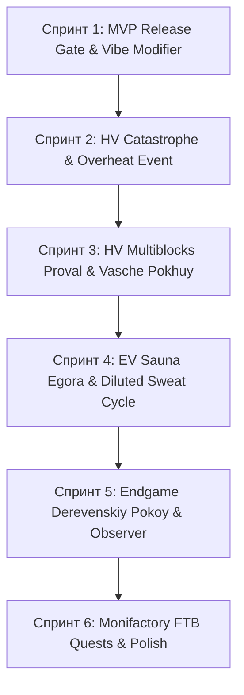

# ArthurTech (skuf-addon) — Последовательный Роадмап задач Linear (Linear Issues Execution Roadmap)

> **Статус проекта:** 33 задачи **Done** · 1 в работе (**In Progress**) · 27 задач открыто (**Todo / Backlog**).  
> **Методология последовательного выполнения:** Каждая задача имеет точные зависимости (`Depends On`), DoD и приоритет. Порядок строго гарантирует отсутствие разрывов прогрессии.

---

## 📊 1. Сводка состояния Linear (По состоянию на 2026-07-28)

| Категория | Выполнено (Done) | Открыто (Todo / Backlog / In Progress) |
|---|---|---|
| **M0 & Баланс** | SKU-6, SKU-7, SKU-8, SKU-11, SKU-81 | SKU-27, SKU-28 |
| **M1 LV & M2 MV** | SKU-12, SKU-14, SKU-16, SKU-17, SKU-18, SKU-47, SKU-48 | **SKU-9, SKU-10, SKU-13, SKU-15, SKU-20, SKU-21 (MVP Release Gate)** |
| **M3 HV & Перегрев** | SKU-34, SKU-68, SKU-69, SKU-75 | **SKU-22, SKU-23, SKU-24, SKU-30, SKU-33** |
| **M4 EV & Сауна** | SKU-59 | **SKU-35, SKU-36, SKU-37, SKU-67** |
| **Эндгейм & Квесты** | SKU-72, SKU-74, SKU-76, SKU-77, SKU-82 | **SKU-25, SKU-38, SKU-39, SKU-40, SKU-41, SKU-43, SKU-44, SKU-61, SKU-66, SKU-78, SKU-79, SKU-80** |
| **Гигиена & Арт** | SKU-45, SKU-46, SKU-49, SKU-50..53, SKU-54..58 | SKU-26 |

---

## 🚀 2. Последовательный План Спринтов (Sequential Sprints Roadmap)

---

### 🟢 СПРИНТ 1: MVP Release Gate & Dynamic Vibe Modifier (Эры 0–2)
*Главная цель: Достичь 100% стабильного прохождения игры от Steam/LV до MV без софтлоков.*

1. **`SKU-15` · Вайб как `recipeModifier` (High, Todo)**
   - **Что сделать:** Реализовать динамическое влияние уровня вайба (`stabilized_vibe`) или его наличия в баке на шансы побочных продуктов и выход в `SkufTiltRecipeLogic.java`.
   - **Depends On:** SKU-14 (Done).
   - **DoD:** Рецепт в Vibe Stabilizer выдает bonus-items при активном вайбе.

2. **`SKU-9` · LV-машины без компонентов MV (Medium, Todo)**
   - **Что сделать:** Проверить все LV-рецепты в `SkufRecipes.java` (`machineCrafting`), убедиться, что ни один LV-крафт не требует предметов с MV (например, `dodik_circuit_2` или `stabilized_vibe`).
   - **Depends On:** SKU-47 (Done).
   - **DoD:** LV-машины собираются исключительно из LV-ресурсов.

3. **`SKU-10` · Побочки и отходы в LV-цепочках (Medium, Todo)**
   - **Что сделать:** Добавить отходы/побочки в фильтрацию и дистилляцию на LV для флейвора и замкнутости.
   - **Depends On:** SKU-9.
   - **DoD:** `normis_filtration` выдаёт побочный `normie_dust` или `slag_ignore`.

4. **`SKU-20` · Квестовая плашка: «Первая Правильная Вещь = MV» (Low, Todo)**
   - **Что сделать:** Подписать в квесте `c3_vesh`, что первый крафт `PRAVILNAYA_VESH` является рубежом выхода в MV.
   - **Depends On:** SKU-15.
   - **DoD:** Текст квеста явно отражает MV-тир.

5. **`SKU-13` & `SKU-21` · DoD MVP Release Gate (Urgent / High, Todo)**
   - **Что сделать:** Выполнить сквозную верификацию выживания с нуля до MV.
   - **Depends On:** SKU-15, SKU-9.
   - **DoD:** Релиз MVP официально разблокирован.

---

### 🟡 СПРИНТ 2: HV Catastrophe Event — «Горящий Пукан» (Эра 3)
*Главная цель: Превратить тильт из простой цифры EU/t в честную механику риска и аварий.*

6. **`SKU-22` · Формула риска и Pukan Indicator (High, Todo)**
   - **Что сделать:** Внедрить расчёт `pukan_indicator` в `SkufTiltUtils.java` по каноничной концепт-формуле (`tilt_heat * 0.55 + sweat_hidden * 0.25 + denial * 0.20 - sauna - vibe`).
   - **Depends On:** SKU-21.
   - **DoD:** Значение риска транслируется в Jade и HUD.

7. **`SKU-23` · Событие катастрофы «Горящий пукан» (уровень 1) (High, Todo)**
   - **Что сделать:** При `ticksAtMaxTilt >= OVERHEAT_RAMP_TICKS` автоматически отключать рецепт, уничтожать установленный кабель/конденсатор и выбивать `burnt_cable_debris` / `burnt_capacitor` в инвентарь или мир.
   - **Depends On:** SKU-22.
   - **DoD:** Машина принудительно останавливается при перегреве с выдачей сгоревших деталей.

8. **`SKU-24` · Ручной ремонт после Пукана (Medium, Todo)**
   - **Что сделать:** Верифицировать и отбалансировать рецепты `repair_burnt_capacitor` и `repair_burnt_cable_debris` в дуговой печи/мацераторе.
   - **Depends On:** SKU-23.
   - **DoD:** Сгоревшие детали легко чинятся на заводе.

---

### 🟠 СПРИНТ 3: HV Multiblocks — «Челябинский Провал» и «Ваще Похуй» (Эра 3)
*Главная цель: Ввести крупные мультиблоки Эры HV для массовой химической переработки.*

9. **`SKU-30` · Мультиблок «Челябинский Провал» (Medium, Backlog)**
   - **Что сделать:** Создать класс `ChelyabinskProvalMachine.java` (`WorkableElectricMultiblockMachine`). Рецепт: `Chelyabinsk Shale` + `Dense Jizhnyak` → `Ural Isotope` (HV·512).
   - **Depends On:** SKU-75 (Done, `CASING_PROVAL_CONCRETE` закоммичен).
   - **DoD:** Мультиблок строится, работает и является основным источником изотопа.

10. **`SKU-33` · Мультиблок «Ваще Похуй» (Low, Backlog)**
    - **Что сделать:** Создать класс `VaschePokhuyMachine.java` на базе `CASING_POHUIT_REINFORCED`. Игнорирует нагрев тильта.
    - **Depends On:** SKU-68 (Done, `CASING_POHUIT_REINFORCED` закоммичен).
    - **DoD:** Мультиблок функционирует без риска катастрофы.

---

### 🔴 СПРИНТ 4: EV Sauna Egora & Diluted Sweat Cycle (Эра 4)
*Главная цель: Замкнуть термальную систему Сауны Егора и дать применение второстепенным жидкостям.*

11. **`SKU-37` · Достроить сток тильта Сауны в радиусе (Medium, Backlog)**
    - **Что сделать:** Реализовать в `SaunaEgoraMachine.java` радиальное охлаждение всех машин `SkufTiltMachine` в радиусе 8 блоков.
    - **Depends On:** SKU-23.
    - **DoD:** Находящиеся рядом тильт-машины медленно снижают `tiltLevel` при работе Сауны.

12. **`SKU-35` · Источник `diluted_sweat` = Сауна-only (Medium, Backlog)**
    - **Что сделать:** Настроить получение `diluted_sweat` исключительно из выхода Сауны Егора (`sauna_diluted_sweat`).
    - **Depends On:** SKU-37.
    - **DoD:** `diluted_sweat` вырабатывается Сауной при подаче воды и вайба.

13. **`SKU-36` · 3 точки применения `diluted_sweat` (Medium, Backlog)**
    - **Что сделать:** Прописать 3 рецепта-потребителя: (1) Перезарядка модуля «Ваще похуй», (2) Рецепт `coolant_of_denial_plus`, (3) Компонент Лирики.
    - **Depends On:** SKU-35.
    - **DoD:** `diluted_sweat` полностью лишен статуса орфана.

14. **`SKU-67` · Перебаланс Сауны как «разрешение на жадность» (Medium, Backlog)**
    - **Что сделать:** Настроить окупаемость Сауны: она разрешает гнать тильт выше без риска аварии.
    - **Depends On:** SKU-37.
    - **DoD:** Баланс верифицирован в `SkufBalanceConfig`.

---

### 🟣 СПРИНТ 5: Endgame «Деревенский Покой» & Observer (Эры 5–6 / UHV)
*Главная цель: Создать финальный эндгейм-предмет и подключить систему реагирования Observer.*

15. **`SKU-38` & `SKU-39` · Предмет и эффект «Лирика в Падике» (Low, Backlog)**
    - **Что сделать:** Зарегистрировать предмет `lyrika_v_padike` и накладываемый эффект `absolute_stasis` (заморозка тильта на 90с).
    - **Depends On:** SKU-36.
    - **DoD:** Предмет крафтится и накладывает бафф.

16. **`SKU-40` & `SKU-41` · Предмет `item_derevenskiy_pokoy_singularity` & Врата `pgt_gate` (Low, Backlog)**
    - **Что сделать:** Добавить финальный предмет и рецепт Врат: `64x ABSOLUTE_POHUIT + 16x PRAVILNAYA_VESH + 8x NORMIS_SINGULARITY + 1x ARTURIAN_MAINFRAME`.
    - **Depends On:** SKU-74 (Done), SKU-76 (Done), SKU-77 (Done).
    - **DoD:** Финальный рецепт собирается и даёт Сингулярность «Деревенский Покой».

17. **`SKU-78` · Гейт-условия финала (Low, Backlog)**
    - **Что сделать:** Проверка мультиблока перед запуском финала: работающая Сауна рядом + отсутствие активного перегрева.
    - **Depends On:** SKU-40.
    - **DoD:** Рецепт финала блокируется, если условия не выполнены.

18. **`SKU-66` · СЛОЙ V4 «Голос Артура» — Observer реагирует на тильт (Medium, Backlog)**
    - **Что сделать:** Связать события `skuf-addon` Java (`tilt_heat_spike`, `pukan_catastrophe`, `sauna_activated`) с `Observer-service / BogA`.
    - **Depends On:** SKU-23.
    - **DoD:** При взрыве пукана Артур выдает ироничный комментарий в чат.

---

### ⚪ СПРИНТ 6: Monifactory FTB Quests & Polish (Сквозное)
*Главная цель: Довести квестбук до 100% готовности и провести полировку.*

19. **`SKU-79` & `SKU-25` · FTB Quests: 10 глав Monifactory-style (In Progress)**
    - **Что сделать:** Завершить `scripts/generate_ftbquests.py` с полной генерацией 10 глав (Steam → UHV).
    - **Depends On:** SKU-40.
    - **DoD:** Квестбук полностью отображается в играбельном виде.

20. **`SKU-26` · JEI / EMI категория + иконка + progressBar (Medium, Todo)**
    - **Что сделать:** Добавить иконки и прогресс-бары для кастомных типов рецептов `SkufRecipeTypes`.
    - **Depends On:** SKU-21.
    - **DoD:** JEI/EMI корректно отображает все рецепты аддона.

21. **`SKU-27` & `SKU-28` · Финальный баланс и `spotlessApply` (Medium, Todo)**
    - **Что сделать:** Прогнать `spotlessApply` и финальный теструн.
    - **Depends On:** SKU-79.
    - **DoD:** Сборка собирается без ошибок и предупреждений.
