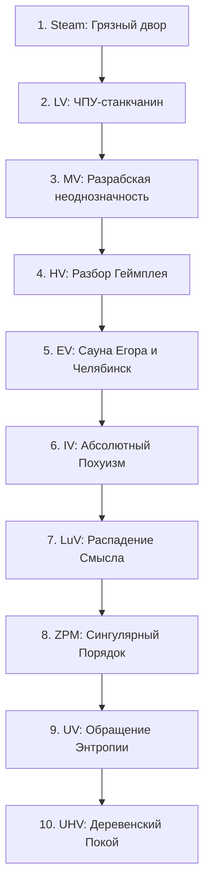

# ArthurTech: Правильные Вещи Урала — Мастер-план разработки v4.5 (Full 10-Era Roadmap & Monifactory Standard)

> **Версия документа:** 4.5 (Полный синтез 10 Эр)  
> **Ориентир качества:** Monifactory FTB Quests Standard (непрерывный граф зависимостей, глубокие лорные описания, техническая точность, 10 разделов квестов).  
> **Идеологический фундамент:** ArthurTech_v3, «Философия Артура в GregTech», «GregTech: Правильные Вещи Урала», `scripts/generate_ftbquests.py`.

---

## 🏛️ 1. Архитектурный синтез концепций и механик

### 1.1. Главный философско-индустриальный закон
> *«Мир не обязан быть удобным. Спасение не в красоте, а в цепочке рецептов, трубе, шлаке, стабильном напряжении и способности смотреть на нормисный абсурд без паники.»*

Все концептуальные документы и структура квестбука сводятся к единому принципу замкнутости (**§14 ArthurTech_v3**):
- Каждый мем и лорный мотив обязан быть **предметом, материалом, параметром машины или рецептом**.
- Никаких фич-сирот: у каждой сущности обязаны быть **И источник получения, И потребитель**.
- Финал мода на UHV-тире — не бесконечные ресурсы (Avaritia style), а **право остановиться** (Сингулярность «Деревенский Покой»).

---

## 🔄 2. Полная матрица 10 Эр Прогрессии (Steam → UHV)

### 1. Steam Age — «Грязный двор» (pre-LV / Steam)
- **Лор:** Начало пути в грязи. Руки устали, но дробление камня — единственный путь к первому слитку.
- **Предметы & Жидкости:** `Сырая жижа`, `Нормисная пыль`, `Челябинский шлак`, `Грязная мысль`, `Скуфит` (руда/слиток/пластина).
- **Машины:** `Котёл Втыкания`, `Ручная Дробилка`, `Фильтр Бытового Абсурда`.
- **Капстоун:** `Honest Steel Ingot` (Честная Сталь) → пропуск в LV.

### 2. LV Age — «ЧПУ-станкчанин»
- **Лор:** Приход электричества. Руки уступают место фрезам. Появление первой нормисной энтропии.
- **Предметы & Жидкости:** `Honest Steel`, `Dodik Circuit 1 (Basic / LV)`, `CNC Bit`, `CNC Cutter`, `PRAVILNAYA_VESH`.
- **Машины:** `Smoldering Pukan Hull (LV)`, `Normis Filtration Machine`, `CNC Machine`, `Pot Distillery`, `Vibe Stabilizer`.
- **Капстоун:** `Dodik Circuit 1` (Схема Додика I) → пропуск в MV.

### 3. MV Age — «Разрабская неоднозначность»
- **Лор:** Программируемый абсурд. Переход от железа к меметическим платам. Разрабские схемы с шансом на брак.
- **Предметы & Жидкости:** `Pokhuit` (ingot/plate), `Dodik Circuit 2 (Advanced / MV)`, `Myposhko Script`, `Crystallized Dodik Sweat`, `Ugar Gas`, `Condensed Sweat`.
- **Механика:** Рост тильта (×1.0–×4.0 EU/t), запуск мультиблока `Skufizator`.
- **Капстоун:** `PRAVILNAYA_VESH` (Правильная Вещь) → пропуск в HV.

### 4. HV Age — «Разбор Геймплея и Челябинский Провал»
- **Лор:** Тяжёлая химия, сожжённые дедлайны и разбор демо-версий.
- **Предметы & Жидкости:** `Dodik Circuit 3 (Extreme / HV)`, `Capacitor`, `Burnt Capacitor`, `Broken Monitor Block`, `Charred Developer Circuit`, `DEMO`, `Technical Tears`.
- **Машины:** Мультиблок `Разбор Геймплея`, `Челябинский Провал` (переработка `Chelyabinsk Shale` + `Dense Jizhnyak` → `Ural Isotope`).
- **Капстоун:** `Technical Tears` (Технические Слёзы) → пропуск в EV.

### 5. EV Age — «Сауна Егора и Конец Культуры»
- **Лор:** Глобальное управление энтропией базы. Борьба с перегревом через термальный гигант.
- **Предметы & Жидкости:** `Egor Core`, `Warm Vibe Steam`, `Diluted Sweat`, `Coolant of Denial`.
- **Машины:** Мультиблок `Сауна Егора` (радиальное охлаждение тильт-машин).
- **Капстоун:** `Coolant of Denial` (Запрещённый Хладагент) → пропуск в IV.

### 6. IV Age — «Абсолютный Похуизм (эндгейм-база)»
- **Лор:** Завод становится метафизическим оплотом порядка.
- **Предметы & Жидкости:** `Arturian Mainframe`, `Absolute Pohuit`, `Correct Matter Microcapsule`, `Antizoomer Core`, `Correct Developer Schematic`, `Normis Singularity`.
- **Капстоун:** `Normis Singularity` (Сингулярность Нормиса) → пропуск в LuV.

### 7. LuV Age — «Распадение Смысла»
- **Лор:** Вход в квантово-меметическую обработку.
- **Предметы & Материалы:** `Casing Pohuit Reinforced`, `Memetic Neutron`, `Defective Meaning`.
- **Машины:** Мультиблок `Меметический Коллайдер`.
- **Капстоун:** `Meaning Stabilizer` (Стабилизатор Смысла) → пропуск в ZPM.

### 8. ZPM Age — «Сингулярный Порядок»
- **Лор:** Сжатие настроения до плотности звезды.
- **Предметы & Материалы:** `Vibe Singularity`, `Factory Order Core`.
- **Машины:** Мультиблок `Singular Vtykatel` (региональный сток тильта 64 блока).
- **Капстоун:** `Factory Order Core` (Ядро Заводского Порядка) → пропуск в UV.

### 9. UV Age — «Обращение Энтропии»
- **Лор:** Строительство величественных индустриальных мегаструктур.
- **Предметы & Блоки:** `Casing Proval Concrete` (Провальный Бетон), `Ural Heart`, `Final Factory Frame` (Каркас Фабрики 15×15×15).
- **Капстоун:** `Final Factory Frame` → пропуск в UHV.

### 10. UHV Age — «Деревенский Покой (ФИНАЛ)»
- **Лор:** Финал мода. Полная победа над нормисной энтропией.
- **Предметы & Блоки:** `Vrata Pokoya` (Врата Деревенского Покоя), `item_derevenskiy_pokoy_singularity`.
- **Гейт финала:** Требует `64x ABSOLUTE_POHUIT + 16x PRAVILNAYA_VESH + 8x NORMIS_SINGULARITY + 1x ARTURIAN_MAINFRAME` при условии работающей Сауны и нулевого активного перегрева.

---

## 📜 3. Стандарт квестбука FTB Quests (Monifactory Level)

Скрипт `scripts/generate_ftbquests.py` полностью реализует 10 глав (`steam`, `lv`, `mv`, `hv`, `sauna`, `endgame`, `luv`, `zpm`, `uv`, `uhv`):
- **Граф зависимостей (`dependencies`):** Каждая из 10 глав имеет входной линк `quest_links` с капстоуна предыдущей эры.
- **Лорные описания (`description`):** Каждая задача содержит 3–5 абзацев лора в стиле заводской философии Артура.
- **Синхронизация:** Автоматическая выгрузка в `run/config/ftbquests/quests` и миры сохранения.

---

## 🛠️ 4. Исполнительный план реализации (5 Фаз)

### Фаза 1: Динамический Vibe Modifier & Release Gate MVP (SKU-15, SKU-21)
- Доработка `SkufTiltRecipeLogic.java` для учета `stabilized_vibe` в выходе рецептов.
- Верификация работы цепочек LV–MV.

### Фаза 2: Событие Катастрофы «Горящий пукан» (SKU-22, SKU-23, SKU-24)
- Реализация выгорания при `ticksAtMaxTilt >= OVERHEAT_RAMP_TICKS`.
- Спавн `burnt_capacitor` и `burnt_cable_debris` при аварии.

### Фаза 3: Мультиблоки HV «Челябинский Провал» и «Ваще Похуй» (SKU-30, SKU-33)
- Реализация классов `ChelyabinskProvalMachine.java` и `VaschePokhuyMachine.java`.

### Фаза 4: Логика охлаждения Сауны Егора & Diluted Sweat (SKU-35, SKU-36, SKU-37)
- Замыкание цикла радиального охлаждения и 3 точек применения `diluted_sweat`.

### Фаза 5: Предмет-финал & Полная генерация 10 Эр (SKU-40, SKU-79, SKU-58)
- Создание предмета `item_derevenskiy_pokoy_singularity` и финального UHV-рецепта.
- Запуск `scripts/generate_ftbquests.py` и `scripts/generate_crafts_tree.py` для 100% обновления квестбука и дерева крафтов.
